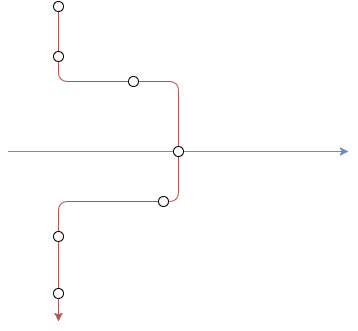

# How does the algorithm work?

## Simulating realtime
The [simrealtime.py](simrealtime.py) file creates a new thread that simulates a real time environment by querying the database for trust and gps reports and calling the appropriate functions when it gets a new report.

### General overview

#### How does it simulate real time?
When you create a SimulateRealTime object and call start, a new thread will be initialized and it will start simulating a real time environment.

The way it does it is by storing the next 100 gps and the next 100 trust reports in the self.records variable. You can imagine it like having 2 queues, one with trust reports and one with gps reports.

Next, the thread starts off by checking the first value in the gps queue and the first value in the trust queue. We compare the time stamps on the reports and store the oldest one in the `current` variable, take it out of the queue and submit it to be processed. After that, we compare the first value in the gps queue and the trust queue and choose the oldest one again and store it in the `next` variable.

Since we want to simulate a real-time environment, the thread sleeps for `(next.time - current.time)` and then submits the next variable to be processed. Finally, the `current` variable is set equal to the `next` variable and we repeat until there are no more gps and trust reports.

The code also gets the next 100 reports once the gps or the trust queue gets too small. The reason we only hold a 100 reports in memory is because of scalability. If we want to test the segment generation with more reports, we will eventually not be able to hold all of them in memory.

#### Cleanup thread
On top of all of this, there is also a cleaner thread. This thread is responsible for going through all of the segments every x amount of time and find segments that have not been updated for a while. After finding those segments, we remove them from the `segments` variable and add them to another variable, called `old_segments`. The reason we do this is because the `addGPS`, `addTrust` and the `interpolate` functions loop through all of the segments quite often. However we know that the
probability of those functions adding a report to a segment that has not been updated for more than 3 hours is close to 0.

Hence instead keeping having to loop through those 'useless' segments, we filter them out. That way we still have access to all of the segments if we need to but we improve the performance of our algorithm slightly.

### Submitting for processing
Until now, we have treated submitting for processing as a high level concept to make the overall concept of real-time easier to understand but it is also an essential part of the simulation.

Once the SimulateRealTime thread is started, it creates a threadpool using the `concurrent.futures` module with a certain amount of worker threads. These threads are actually responsible for all of the data processing and generating the segments. Every time we submit a report for processing, we check if it is a trust or a gps report. Depending on the type, we submit it for a different kind of processing.

This means that the task gets added to a task queue, which will eventually be executed, as soon as one of the threads in the threadpool is finished processing a previous report.

## Threading
Since we have multiple threads, we need to assure thread safety, which we currently do using 2 different locks. First of all, we do not want 2 or more threads reading and writing to the segments variable at the same time. This is why, every time we read or write from the variable, we use the `lock` variable.

Additionally, since SQLAlchemy is not thread safe from default, we are currently using the `db_lock` variable whenever we access the database.


## Segments
What the algorithm currently does is creating segments from all of the reports that are coming in.
We define a segment to be a a set of consecutive gps reports, with their matching trust reports. However the gps and trust reports in one given segment can only be from 1 rolling stock and service respectively.

The data structure of a segment can be found in [globals.py](globals.py). At the moment, all of the segments are stored in memory but eventually they will be stored in the database.

These are all of the data structures:

**Segment:**
- cif_uid - *String*
- gps_car_id - *String*
- headcode - *String*
- isPlanned - *Bool*
- remove - *Bool*  
- matching - *Array of Dictionaries*
    - supposed_to_run: *Bool*
    - gps - *gps_report*
    - trust - *trust_report*
    - dist_error - *Int*


**Trust Report:**
- id - *Int*
- headcode - *String*
- event_time - *datetime.datetime*
- event_type - *String*
- origin_departure - *datetime.datetime*
- origin_location - *String*
- planned_pass - *Bool*
- seq - *Int*
- tiploc - *String*
- predicted - *Bool* // If the event was supposed to happen according to the schedule


**GPS Report:**
- id - *Int*
- event_type - *String*
- tiploc - *String*
- event_time - *datetime.datetime*
- gps_car_id - *String*


## Constructing segments
There are 2 main files that are responsible for creating the segments: [filter_gps.py](filter_gps.py) and [filter_trust.py](filter_trust.py). Both add or change segments using a different algorithm.

The functions in [filter_gps.py](filter_gps.py) and [filter_trust.py](filter_trust.py) are executed by a threadpool.

### Adding gps reports to a segment
1. Goes through the segments and finds the most recent one with the same gps_car_id.
2. Goes through all of the matching events in that segment and checks if there is potential trust report, that has no match.
3. It filters those potential trust reports to see if any are within a given tolerance, if there are, it adds the gps report to that trust report.
4. Else if there is no trust report:
  1. If there is no potential segment, it adds a new one, containing the gps report.
  2. Else it adds the gps report to that segment.

### Adding trust reports to a segment
1. Goes through the segments and filters out the ones that either have the same headcode as the report or the ones that don't have a headcode yet.
2. In all of those segments, the algorithm looks at the gps reports, that don't have a match yet. Then we filter out the segments that contain a potential match for the trust report.
3. Another filtering layer, then looks at the unit code of the segment and the headcode of the trust report and checks if that rolling stock was supposed to run the service according to the genius allocations.
4. From those filtered segments, it chooses the one with the most matches and the most amount of times that 'seq' is respected.
  1. If it does not find a segment, it creates a new one, containing the trust report.
  2. Else it looks through all of the gps reports that don't have a matching trust report yet. Then it chooses one, depending on the tolerance and if it respects the 'seq' field.


### Heuristics
This part attempts to explain the reasoning behind the algorithm described above.

#### Adding GPS reports
There are a lot more gps reports than trust reports. Therefore most of the time, the algorithm will add gps reports to an existing segment without finding a matching trust report. It does this is by first finding a segment with the same gps_car_id and the most recent gps report.


For instance if we have two segments, each with a gps_car_id '15068'. The first segment represents the time when the rolling stock ran service '1A02' and the second segment represents a different service that it is currently running. We want to add the newest report to the segment that the rolling stock is currently running and we select it by finding the segment with the most recent gps report.


However we want to create a new segment as soon as that rolling stock starts running a new service. Which is why it also looks for segments with no gps_car_id, and see if it can match the gps report to the existing trust report(s) in that segment. If it can, it will add the gps report to that segment. Otherwise, it will look for a matching trust report in the previously found segment and add the report to that.


There are some other special cases where for example it does not find a potential segment. In those cases, the algorithm will often create a new segment. This is often found when for example a rolling stock starts running.

#### Adding TRUST reports
At the same time, we continue to receive trust reports. In the beginning, we do some very similar processing. We go through the segments and filter out the ones with the same headcode as the report. However if we do not find one, that is an indication that this service just started running. In this case, we either look for a segment that does not have a headcode, and look for a matching gps report. If we find a potential match, we add the trust report to that segment. But if we do not find one, we simply create a new segment.


However what happens most of the time is that we get a set of segments that have the same headcode. This should be a relatively small set so we can look through the matching array and filter out sets that do not have any potential matching gps reports.


We know that it is more likely for a service to be run by the rolling stock specified by the genius allocation. Hence, we prefer segments with the same gps_car_id as the rolling stock that was supposed to run the service.


If we still have more than one segment in the set, which is highly unlikely, we need another way of choosing one above the other. The way we decided to do this is by giving a preference to the segment with the most matches.
For instance if we look at the figure below, red and blue represent two potentially matching segments. Imagine we are currently processing the overlapping trust report. We would prefer the red segment because it has a higher number of matching reports. Additionally, to be sure we also analyse the amount of times both segments respect the seq value.



All of the above constructs the segments with reasonable accuracy, however we still can go over some of the segments and check if we could improve them. This is discussed in the next section.

## Interpolating

After we have inserted a trust report, we also perform what we identify as interpolating. It means that we go over a certain amount of segments and try to increase their accuracy.


First, the algorithm goes over the segments with the same gps_car_id and tries to join them together. For instance if we look at figure 2 below, we can see 3 segments. Each segment is represented by an arrow. The colour of the arrow represents the gps_car_id and the circles represent the trust reports.

We can see that in the middle, there is a very short segment with only 1 stop and the two other (outer) segments have multiple stops and have the same gps_car_id. Looking at the diagram, we know that it is very likely that we can combine all three segments into one segment with the same gps_car_id as the first and the last segment. This is exactly what the first step of interpolation does.


The second step then checks if there are any segments, without a headcode yet that might be running the same service as another rolling stock. If it finds such a segment, it adds all of the matching trust report to the appropriate gps reports.

Finally, after analyzing the data output from the algorithm, we noticed that there were a lot of segments with only trust reports. But these trust reports could have been added to another segment with both gps reports and trust reports. As you can see below. Imagine the red circles are gps reports and the blue circles are trust reports. We can clearly see that the trust reports in the right segment can be added into the left segment. However because of the nature of our algorithm, if a new trust report does not find a match in the left segment, it will be added into the right segment.


We carefully considered changing the algorithm to make up for this flaw. But this small flaw was not worth the time that we would spent redesigning and reimplementing a large part of the algorithm. Therefore we decided that we could solve this issue in the interpolation stage.
After performing all of the processing, mentioned above, the algorithm also checks if there is a segment with no `gps_car_id`. If there is, it tries to insert the trust reports in that segment into another segment with the same headcode.

## Misc

#### Command for killing background threads using python
```kill -9 $(ps aux| grep '[p]ython app.py'| awk '{print $2}')```